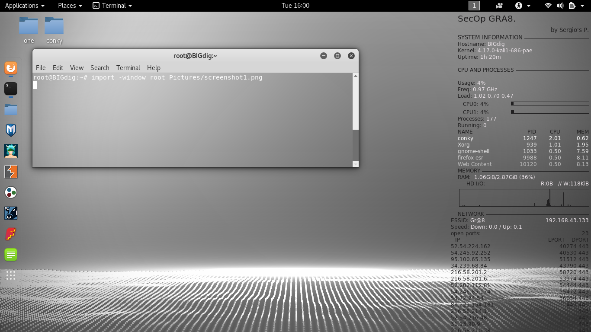

#	CONKY (LINUX for Pen_ters and Admin_rs)

#####	Sergio's P.

Format: 

#	Conky distibutive

		-Its program to show on desktop usfull information about
		software, hardware, network. Most useful for Pen_trs 
		and Admin_rs is's network tools.
#####	Install Conky	

		-To install conky on Linux machine you need write command:
		Ubuntu, Kali, Debian and so on.,
			sudo apt install -y conky conky-all
			sudo apt-get install -y conky conky-all
	
		Fedora, Red_Hat.,
			yum install conky conky-all

#####	File conky.conf
		
		Most information about how to edit and use conky.conf file 
		you can search in Internet.  
			File conky.conf should be edited to change view of
		your conky on the Desktop. Code of my conky.conf file in
		repository.				
	
#####	Conky on Startup of machine
		
		-By my experiance I made it on the way of terminal profile.
		In the menu of Terminal->Edit->Preferences
		Profile "name"(default profile) you should find in:
		Text Colors Scrolling ->Command<- Compatibility
		
		In Commands chuse Run command as a login shell and in
		Custom command:  conky  
			After thet you should change code inside 
		
		#nano /etc/conky/conky.conf
		
		-Other way is:
		mkdir -p ~/.config/autostart
		nano ~/.config/autostart/conky.desktop
		#copy this text to file
		[Desktop Entry]
		Type=Application
		Exec=/usr/bin/conky
		Hidden=false
		NoDisplay=false
		X-GNOME-Autostart-enabled=true
		Name=conky
		Comment=
		
		Push Ctrl+X then y Enter Enter.

		After thet you should create file on root directory '/'
		with name:

		#sudo nano .conkyrc

		and paste code inside this file and save it 

		After all reboot PC.
